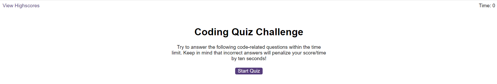
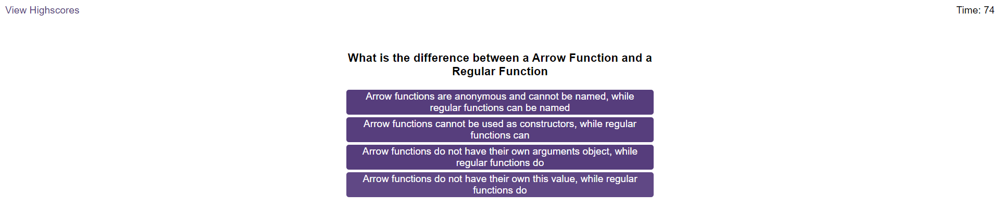
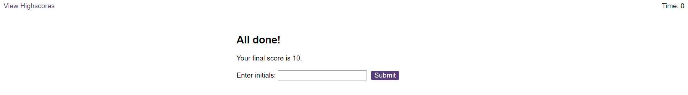
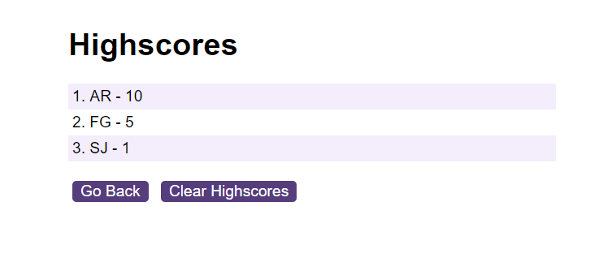

# Code Quiz

## Table of Contents
* [Screenshot of page](#screenshot)
* [Information](#information)
* [Installation](#installation)
* [License](#license)
* [Tests](#tests)

## Screenshot

## Information
The HTML and CSS for this page were given to me by the edX bootcamp: Skills Boot Camp in Front-End Web Development. My task was to write the JavaScript for this page. The program asks the user a number of questions. If the user answers the question correctly, the score is increased by 1. If the user answers the question incorrectly, the amount of time remaining is reduced by 5 seconds. The program counts the users's score. After the user has finished answering all of the questions, the user is told his/ her final score and can save the score. The user can also view all of the previous scores.

## Installation
Click on this link: https://programmer90000.github.io/code-quiz/

## License
GNU GENERAL PUBLIC LICENSE (GPL) version 3.0

## Tests
Click the Start Quiz button. Check if the first question is shown
Click an answer. Ensure that when the correct answer is selected, the message Correct! is shown. Ensure that when the incorrect answer is selected, the message Wrong! is shown
Ensure that after the wrong answer is chosen, the timer is reduced by 5 seconds
Ensure that after answering all questions, the timer resets to 0
Ensure that when the timer is 0, the comlpeted quiz section is shown
Ensure that my score is shown
Ensure that I am able to enter my initials and click the Submit button
Ensure that I can click on the View Highscores button
Ensure that when I click on the Highscores button, all of the previous scores are shown
Ensure that each row contains the initals and the score
Ensure that the scores are sorted in ascending order
Ensure that clicking the Clear Highscores button removes all of the highscores
Ensure that clicking Go Back returns to the first screen
